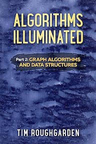
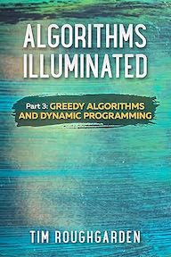
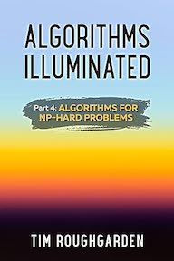

# Algorithms

Self-study implementations from the book series _Algorithms Illuminated_ by Tim Roughgarden






# Usage

```bash
bundle exec rake test
bundle exec rake test TEST=test/algorithms/part1/test_rec_int_mult.rb
bundle exec rake test TEST=test/algorithms/part1/test_rec_int_mult.rb TESTOPS="--name=test_rect_int_mult"
```
